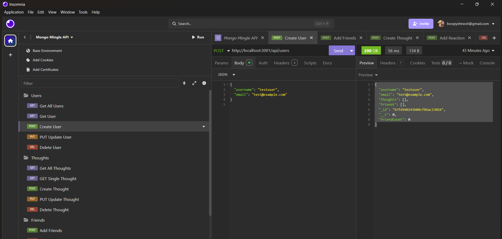

# 🌊 Ripple API

> *Where thoughts ripple through the social network like waves in the ocean!* 🏄‍♂️

A modern, lightning-fast API for a social network web application where users can share their thoughts, react to friends' thoughts, and create their digital friend circle. Built with love (and a lot of coffee ☕) using Express.js, MongoDB, and Mongoose ODM.

## 🎥 Live Demo

### Screenshot

*The beautiful interface of Ripple API in action!*

### Video Walkthrough
[Watch the Demo Video](https://drive.google.com/file/d/1Qopm7VOFTaDiSt3TOOUBvvCxWolK6AMf/view?usp=drive_link)
*Click the link above to watch the full demo video!*

## 📑 Table of Contents

- [🚀 Installation](#installation)
- [💻 Usage](#usage)
- [📊 Models](#models)
- [🛣️ API Routes](#api-routes)
- [📜 License](#license)

## 🚀 Installation

1. Clone the repository to your local machine (like a digital treasure hunt! 🗺️)
2. Install MongoDB on your machine. Follow the [MongoDB installation guide](https://coding-boot-camp.github.io/full-stack/mongodb/how-to-install-mongodb) to install MongoDB locally
3. Navigate to the project directory (your new digital home 🏠)
4. Run `npm install` to install the necessary dependencies (gathering your digital tools 🛠️)

## 💻 Usage

1. Start the MongoDB server by running `mongod` (awakening the database dragon 🐉)
2. Run `npm start` to start the Express server (your API is now alive! ⚡)
3. Use Insomnia to interact with the API endpoints (time to make some waves! 🌊)

## 📊 Models

### 👤 User

- `username`
  - String
  - Unique (because you're one of a kind! ✨)
  - Required
  - Trimmed (no messy edges here! ✂️)

- `email`
  - String
  - Required
  - Unique
  - Must match a valid email address (we need to reach you! 📧)

- `thoughts`
  - Array of `_id` values referencing the `Thought` model (your digital diary 📔)

- `friends`
  - Array of `_id` values referencing the `User` model (your digital squad 👥)

**Schema Settings**:
  - Virtual called `friendCount` that retrieves the length of the user's `friends` array field on query (keeping track of your social circle! 🔄)

### 💭 Thought

- `thoughtText`
  - String
  - Required
  - Must be between 1 and 280 characters (Twitter who? We're keeping it concise! 🎯)

- `createdAt`
  - Date
  - Set default value to the current timestamp
  - Use a getter method to format the timestamp on query (time flies when you're having fun! ⏰)

- `username`
  - String
  - Required

- `reactions`
  - Array of nested documents created with the `reactionSchema` (let the reactions flow! 🌊)

**Schema Settings**:
  - Virtual called `reactionCount` that retrieves the length of the thought's `reactions` array field on query (counting those digital high-fives! ✋)

### 💫 Reaction (Schema Only)

- `reactionId`
  - Mongoose's ObjectId data type
  - Default value is set to a new ObjectId

- `reactionBody`
  - String
  - Required
  - 280 character maximum (keeping it snappy! 🎯)

- `username`
  - String
  - Required

- `createdAt`
  - Date
  - Set default value to the current timestamp
  - Use a getter method to format the timestamp on query

## 🛣️ API Routes

### `/api/users` 👥

- `GET` all users (meet the crowd! 👋)
- `GET` a single user by its `_id` and populated thought and friend data (finding your digital twin! 🔍)
- `POST` a new user (welcome to the family! 🏠)
- `PUT` to update a user by its `_id` (time for a digital makeover! 💅)
- `DELETE` to remove a user by its `_id` (farewell, friend! 👋)

### `/api/users/:userId/friends/:friendId` 🤝

- `POST` to add a new friend to a user's friend list (making new friends! 🌟)
- `DELETE` to remove a friend from a user's friend list (parting ways! 👋)

### `/api/thoughts` 💭

- `GET` to get all thoughts (reading minds, digitally! 🧠)
- `GET` to get a single thought by its `_id` (finding that needle in the digital haystack! 🔍)
- `POST` to create a new thought (let your thoughts ripple! 🌊)
- `PUT` to update a thought by its `_id` (time for a thought makeover! 💭)
- `DELETE` to remove a thought by its `_id` (out with the old! 🗑️)

### `/api/thoughts/:thoughtId/reactions` ⚡

- `POST` to create a reaction stored in a single thought's `reactions` array field (react with style! 🎨)
- `DELETE` to pull and remove a reaction by the reaction's `reactionId` value (taking it back! ↩️)

## 👥 Authors and Pair-Programming BFFs

- Guy Ricketts (KnifeDad) - [@KnifeDad](https://github.com/KnifeDad)
- Muhsina Shinwari - [@Muhsina-de](https://github.com/Muhsina-de)

## 📜 License

This project is licensed under the MIT License. Go forth and code! 🚀

---

*Made with 💖 and a sprinkle of digital magic ✨ by KnifeDad and Muhsina*
